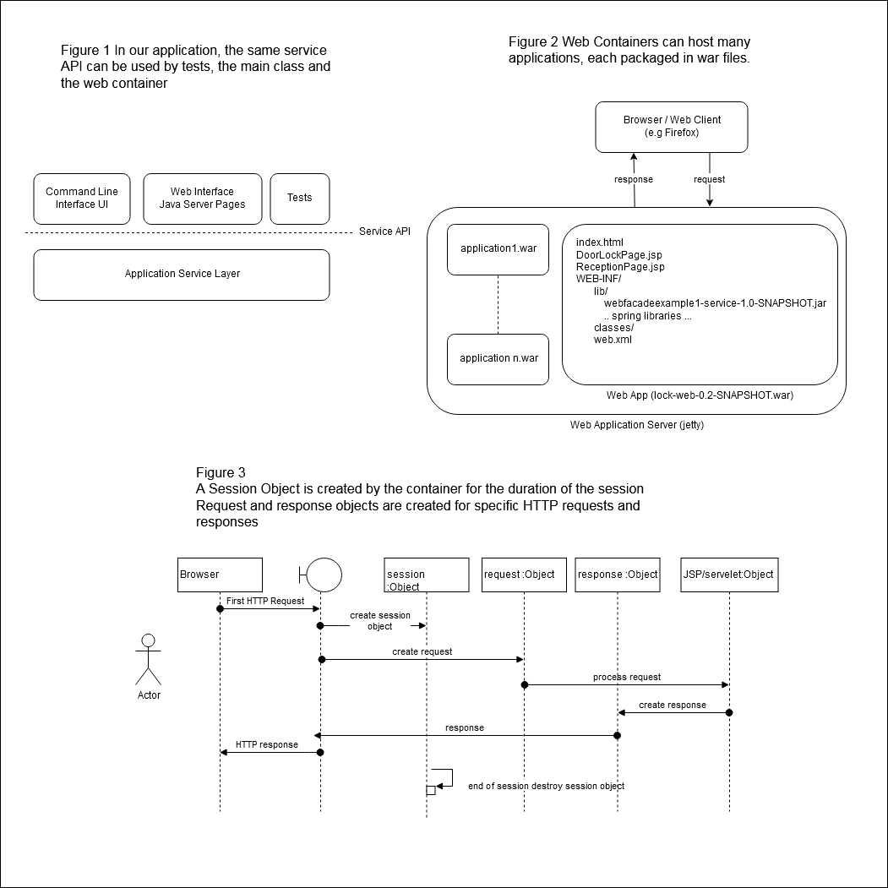

# Week 3 - Creating a Web UI using JSP  

This week we will introduce Java Server Pages and show how they can be used to create a web UI.
To do this we will add a web ui to the doorlock project we worked on as a TCA last week.

In the completed examples TCA, we added MAIN.java classes to provide a simple Command Line Interface for our project. 
Like the tests, these CLI classes used the same service layer to provide the business logic for the application.

Figure 1 below illustrates that we can also use this service layer to drive a web UI using Java Server Pages (JSPs).

## Java Server Pages
Java Server Pages are a complex technology but fortunately, we only need to understand a small subset to make a working application.

We will only do a very brief introduction here. 

There are many JSP tutorials on line (e.g. https://docs.oracle.com/javaee/1.3/tutorial/doc/JSPIntro11.html) and you are strongly recommended to spend some time familiarising yourself with JSP's after class

Figure 2 explains the architecture of a Web Container which hosts JSPs. 
A Web Container allows multiple Web Applications to coexist on the same server. 
Each web application is contained in a zip file called a Web Application Resource file with the suffix .war.

A war contains static web resources (such as index.html or css files), dynamic web resources (JSPs) and an xml deployment descriptor called web.xml.
It may also contain a number of precompiled classes and/or a /lib directory which can contain jar archives.

The contents, libraries and class path of each war are treated completely independently with separate class loaders by the web container.

Figure 3 illustrates the message flow and object creation in handling a web request.

Java Server Pages are very similar in concept to PHP web pages. 
Each page contains a mix of HTML elements and escaped java code.
When a jsp is first accessed, the web container converts it 'on the fly' to a java file called a servelet which is then compiled into a runnable class. 

The servelet is given access to a session object and a request object. 

The session object lasts for the duration of the session i.e. from the first request until the browser session is closed down or times out.
Session objects are used to store objects which will be used across multiple page requests.

The request object contains the parameters of the HTTP request and is used by the code in the jsp to create a response. 

The servelet is expected to return a response object which will contain the correctly coded HTML web page to be returned to the client browser.

## Web Application Servers and Tomcat
Many web application servers are available including Apache Tomcat http://tomcat.apache.org/ and Eclipse jetty https://www.eclipse.org/jetty/

In theory war's should be interchangeable between application servers and work just as well. 
Unfortunately there are subtle differences between servers in the web.xml and other configuration files so each war needs to b targeted on a particular server. 

In our project we will be using Apache Tomcat as our application server. 

# Exercises for week 3 Intoducing JSP web pages

## Set up
1. remember to merge your project with the upstream project
2. create a new 'week3' folder under your myPracticeCouseWork folder.
3. copy the contents of week3 into this folder and modify or add to the code here as needed. (NB only change any code in myPracticeCouseWork).

## Exercise 1 webfacadeexample1

In this exercise you will look at how the facade and factory you created last week can be used as the back end of a web site. 

Try the  [webfacadeexample1](../week3/webfacadeexample1) exercises.

