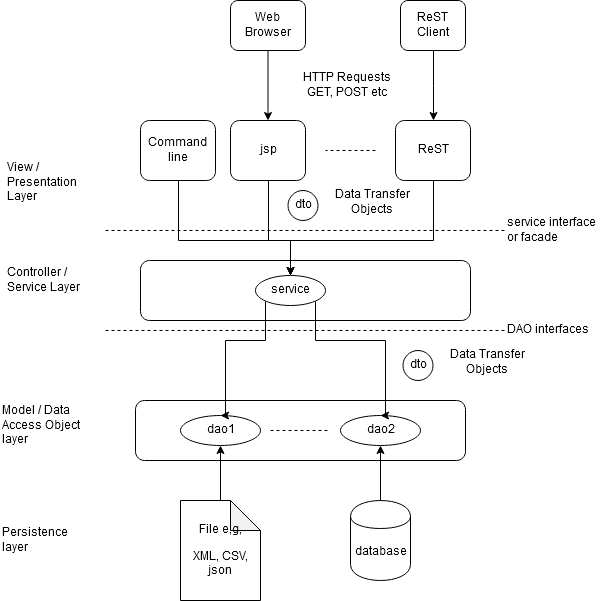

# Week 4 - Using a simple Data Access Object for persistance

In our previous example we create a simple service facade object which contailed all of the business logic for our application.
This was used by the java server pages (JSPs) to render the web page.

This week we are extending this by creating a 'persistance layer' below the service later. 
This layer is reponsible for persisting instances of objects in our model to some form of permanant data store.
The objects in this layer are usually called Data Access Objects or DAOs.

Each of the DAO's implements a DAO interface defined in the model.
The service logic in the layer above can use multiple DAO's to access and work with the data it needs.
Because we have implimented a DAO inteface, we can change the type of persistance which the system uses simply by changing the DAO implementation classes we are using. We might save date to a database or to a CSV file or to an XML file. The service layer above does not care how the DAO works, only that it implements the interface correctly.

Note that objects called Data Transfer Objects DTO's are used to pass data between the layers.
The DTO's are usually simple classes (Plain old Java Objects - POJOs) conformng to the java bean convention of having with getters and setters.
These ar defined in the model.

# Exercises for Week 4 Using a simple Data Access Object for persistance

## Set up
1. remember to merge your project with the upstream project
2. create a new 'week4' folder under your myPracticeCouseWork folder.
3. copy the contents of week4 into this folder and modify or add to the code here as needed. (NB only change any code in myPracticeCouseWork).

## Exercise 1 webfacadeexample2

In this exercise you will look at how the new layeof persistance can be used as the back end of a web site. 

Try the  [webfacadeexample2](../week4/webfacadeexample2) exercises.

